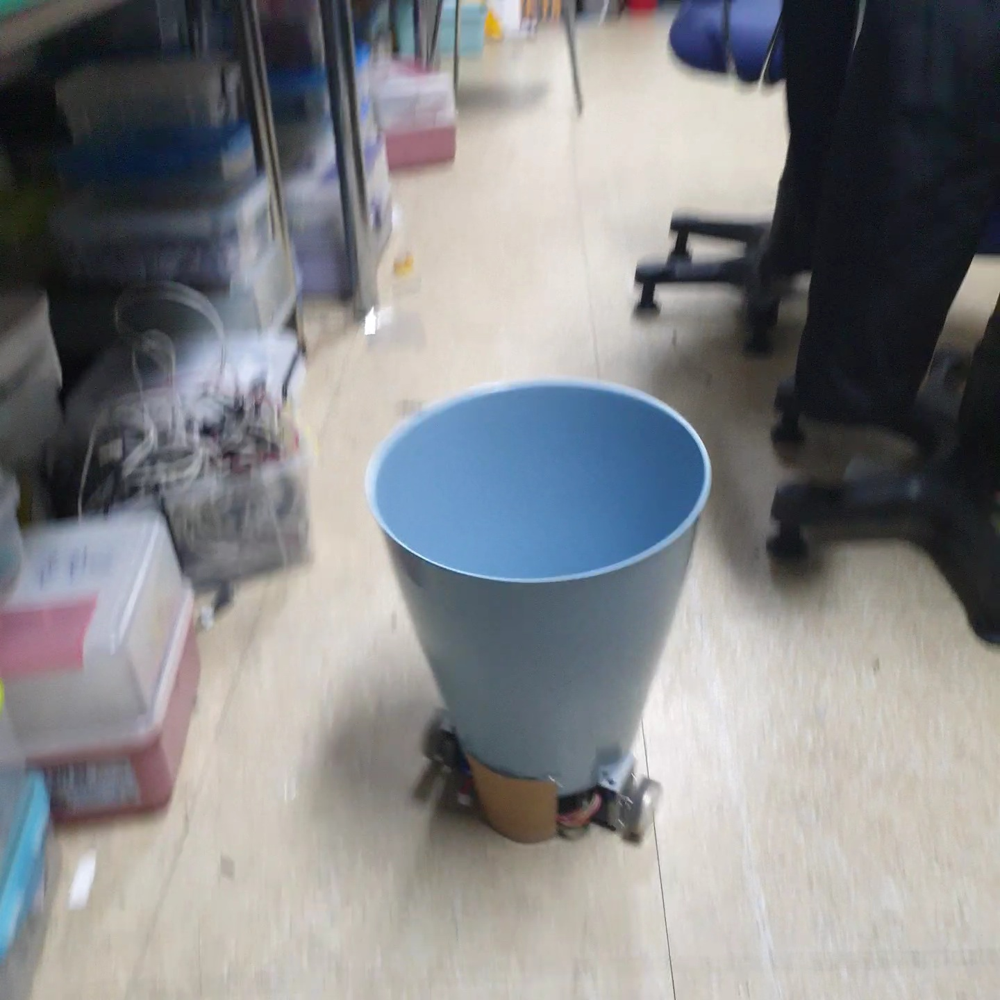
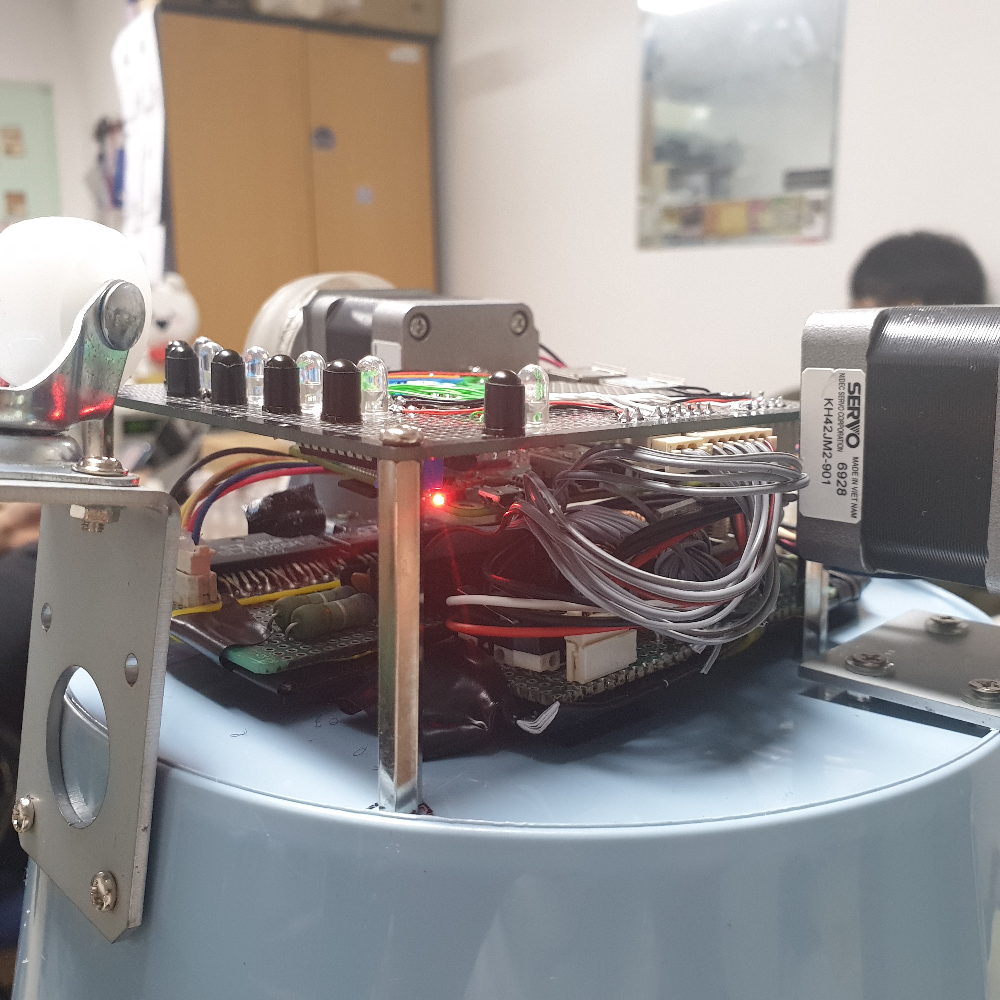

# Line Following Trashcan

## 요약

움직이는 쓰레기통을 만들어보았습니다.

<div style="display:flex;flex-direction:row;justify-content:space-around">


</div>

### Test Videos

아래는 개발 도중 진행하였던 테스트들 영상 링크입니다.

1. [Motor Speed Test](https://youtu.be/60Z-cCqDNXo)
2. [Fixed Distance Drive Test](https://youtu.be/_C2uZ1Y84mg)
3. [Turning Test](https://youtu.be/3oYxH0rKlmY)
4. [Remote Controlled Drive Test](https://youtu.be/yMFtz8GeUnU)
5. [Line Following Drive Test](https://youtu.be/30XmRnQbsOw)

## 과제 성립의 배경
학교 건물과 같은 실내, 혹은 그와 준하는 넓은 공간에서 다수의 쓰레기통이 필요한 경우가 많다. 그런데 쓰레기통을 여러 개 배치하면 관리가 어렵고, 쓰레기통을 적게 배치하면 쓰레기가 넘치는 경우가 많다. 이에 스스로 이동하여 관리가 편리하고 소수의 쓰레기통만으로도 다수가 있는 것 같은 효과를 볼 수 있는 시스템을 제시하고자 한다.

## 기존의 문제점
- 쓰레기통이 멀어 쓰레기를 버리기가 불편한 경우가 많음.
- 쓰레기통을 생활 공간 가까이에 두면 악취, 벌레 등 여러 문제점이 발생함.
- 학교 등 넓은 공간에서는 쓰레기통을 여러 개 사용해야하므로 관리가 어려움.
- 쓰레기통이 다 찼는지 알기 위해서는 사람이 주기적으로 확인하거나, 아니면 다 차기 전이라도 주기적으로 버려야 하므로 자원 및 노동력의 낭비가 있음.

## 새로운 요구사항
- 원할 때 바로 쓰레기를 버릴 수 있어야 함.
- 그러므로 사용자가 선택한 위치로 쓰레기통이 이동할 수 있어야 함.
- 쓰레기통이 가득 차면 바로 확인할 수 있어야 함.
- 컴퓨터를 사용하여 일괄 제어가 가능해야 함.
- 쓰레기통이 이동 중 장애물을 감지하고 대응할 수 있어야 함.

## 설계 목표
위 제시된 요구사항들을 충족할 수 있는, 컴퓨터로 제어가능한, 라인을 따라 이동하는 쓰레기통을 개발하고자 함.
- 예상도 : (바퀴는 Omni wheel을 사용하고자 하였으나 3D모델을 구하지 못하여 일반 바퀴로 대체함.)


## 설계 내용 (순서는 실제 설계 순서와 무관함.)
- 앱 설계 : 통신 프로토콜, 조작 방법, OS, 개발 환경/언어
- 제어부 하드웨어 설계 : 마이크로프로세서 종류, 통신 방법, 위치 등
- 제어부 소프트웨어 설계 : 마커 인식 방법, 마커 프로토콜, 구체적 제어 방법 등
- 센서부 하드웨어 설계 : 센서 종류, 스펙, 개수, 위치, 결선 등
- 구동부 하드웨어 설계 : 모터/휠/브라켓  종류, 스펙, 개수, 위치, 결선 등

## 현실적 제한 조건
- 제한된 금액 내에서 프로젝트를 진행하다 보니 성능이 좋은 모터나 센서 등을 활용하기가 어려워 정밀한 계산이 불가능함.
- 트랙이 그려져있는 실내에서만 활용 가능함.
- 경사로에서 이동하기 불리함.

## 설계 단계
본 리포지토리에 포함된 [간트차트](Development%20Documents/설계%20단계%20Gantt%20Chart.pdf) 참조


## 필요한 제품 리스트
- 스텝 모터 2개
- 스텝 모터 드라이버
- 스텝 모터용 바퀴 2개
- 롤러 바퀴 2개
- 스테인리스 쓰레기통
- 라즈베리파이
- IR 센서 6조 & MUX & ULN
- 초음파 센서 3개
- 배터리 22.2V
- ADC
- 브레드보드 & 만능기판
- 기대효과
- 깨끗한 환경 조성 
- 공유 쓰레기통으로 활용해 병원이나 양로원 등에서 거동이 불편한 사람들에게 도움을 줄 수 있음
- 쓰레기를 버리러 직접 가야하는 수고를 덜어줌.

## 세부목표 및 문제점, 도출된 아이디어
- 길을 미리 입력해두어야 길찾기가 가능해지는데, 이 경우 길을 수동으로 입력하기 힘들다.
- DFS알고리즘을 사용하여 자동으로 맵을 탐색
- 맵상에서 최단거리를 탐색하여 이동해야 한다.
- 다익스트라 알고리즘을 사용하여 해결
- 다익스트라 알고리즘은 노드에서 노드로 이동하는 것인데, 실제 사용 시에는 간선의 중간에서 이동하는 경우도 있음
- 이를 고려한 새로운 탐색 알고리즘을 개발
- 라즈베리파이에는 OS가 깔려 있는데, 이로 인해 발생하는 context switching으로 인한 로드 때문에 스텝모터 제어가 힘들다.
- 리눅스에서 제공하는 isolcpus기능을 사용하여 라즈베리파이 쿼드코어 중 하나를 분리, 커널과 독립적으로 기능을 수행하도록 한 후, 모터 제어 프로세스를 구동한다.

## 시행착오 및 해결방안, 학습 내용 등
### 하드웨어
- 소켓 위치 잘못 설계하면 가려져서 못 꽂음. 완성 상태 생각하고 소켓 설치할 것.

- 이번에 라즈베리파이 꽂을 때 메인보드 ADC 위치랑 라즈베리파이 CSI핀 위치가 겹쳐서 끝까지는 안 꽂혔음. 부품 모양 제대로 확인하고 배치할 것.
- 부품 배치할 공간 부족해서 쓰레기통 새로 삼.
- 부품을 어떻게 설치할지 생각해놨어야 함. (부품 규격 등)
- 서포터 없이는 제작이 힘들 것(특히 다층 구조)
- 회로 설계 시 전원이 여러 개면 그라운드 전부 통일할 것. 특히 노트북과 연결하여 사용할 시 노트북 그라운드도 제대로 다 연결했는지 확인할 것.(센서 작동 이상해짐)
- 모터드라이버 사용 시 성능 확인 및 유니폴라/바이폴라 작동방식 정확히 숙지할 것.
- 센서 수광/발광 파장 생각하고 구입할 것(이번에는 조금밖에 차이 안 나서 괜찮았음.)
- 입출력부분에서 제대로 작동하지 않을 경우 프로세서 고장 의심할 것. 아두이노에서 ADC사용할 때, 그 핀(A0핀)이 고장나서 바이어스 전압 생겨서 측정이 제대로 안 됐음.
- 모터 상 순서 확실히 알아볼 것.
- 모터 제대로 작동하지 않을 시 접촉불량 확인해볼 것.
- 플라스틱에 구멍뚫을 때 인두기로 뚫으면 편함.
- 하드웨어 디버깅할 때 반드시 오실로스코프로 찍어볼 것.
- 파워 모터드라이버에서 끌어썼더니 제대로 작동 안 함. 파워는 제대로 된 거 하나 만들어서 쓰자.
- 전원 방향은 항상 유의하자.
### 하드웨어 제어(소프트웨어)
- 파이썬은 속도가 좀 느려서 탈조가 잘 일어났음.(속도 때문인지 불확실, 여러 오류 있었음)

- SLA7026사용 시 phase를 반전해서 줘야 함.

- 라즈베리파이에서 GPIO가 8bit가 아니라 32bit라서 memory map 사용 시char\*로 포인터를 주면 안 되고 int*로 줘야 함.

- 라즈베리 1과 2,3의 GPIO base address가 서로 다름

- clock_gettime함수의 tv_nsec값은 1,000,000,000ns=1sec마다 초기화됨. 현재 시간에서 시작 - 시간을 뺐을 때 음수가 나오는 경우는 버퍼 오버플로우로 인해 발생하는 현상이 아니므로, unsigned를 쓰거나 int의 최댓값을 더하거나 하면 안 되고 1000000000을 더해주어야 함. 애초에 사용 식이(Tc-Ts)<dt인데, Ts+dt>1000000000이면 문제가 된다. 이럴 경우 Ts에서 1000000000을 빼 주면 될 듯하다.

- memory map 함수 mmap 사용하려면 superuser권한 있어야 함. 아니면 아마도 segmentation error 날 것,

- segmentation error는 mmap에서 할당한 것 외에 접근했을 때 발생함.

- printf함수가 호출된 후 segmentation error가 발생했다 하더라도 printf결과가 무시될 수 있음. 아마도 버퍼가 날아가서 그런 듯.

- 라즈베리파이 GPIO 레지스터는 write-only인 듯. 값을 변경하여 출력을 변화시킬 때, 실제로 출력이 변화되더라도 읽은 값은 일정하였음. 따라서 읽은 GPIO값에 기반한 수정은 하면 안 됨.

- 프로그램 실행이 종료되어도 GPIO레지스터 값 그대로 남아 있음. 아마도 껐다 켜도 마찬가지. 반드시 초기화 루틴 / 강제 종료 시 초기화하는 루틴 필요.

- GPIO 핀 mmap으로 할당받아놓고 실수로 이상한 범위 초기화하면 ssh가 끊겼다. 아마 인터넷 관련 - 부품 건드린 듯. mmap쓸 때는 데이터시트 보고 정확한 범위만을 할당받자.

- 만약 인터넷이 연결되지 않을 때에는 아래의 커맨드를 순서대로 입력하여 네트워크 인터페이스를 재시작해보자.

  ```shell
  ifconfig wlan0 up  
  sudo wpa_cli reconfigure  
  sudo systemctl restart wpa_supplicant  
  sudo systemctl daemon-reload  
  sudo systemctl restart dhcpcd
  ```

- 만약 노트북 등에서 핫스팟을 켜서 라즈베리파이를 접속시키려 하는 경우라면, 5G를 사용하는 환경이 문제였을 수 있다.

- 커스텀 라이브러리와 표준 라이브러리를 한 프로세스 내에서 함께 사용하지 말자. 오류 나더라.

- 센서 프로세스와 모터 프로세스 한 번에 실행시키니까 오류 난다. 적당히 텀을 두는 것이 좋을 듯하다.

### 탐색 알고리즘

#### DFS 탐색
- 추정 오차 조정: 초기 버전은 오차를 x, y를 따로 축적하였다. 그리고 이미 방문한 노드에 이웃한 노드를 방문하게 된다면 현재의 추정 오차를 갱신한다. 그런데, 오차를 x, y 따로 관리하게 된다면, 오차를 갱신한 뒤 다음 정점을 방문할 때 (x, y 중 하나의 변수에 대하여) 로봇이 인식하는 위치에 누적된 오차보다 갱신한 오차가 너무 작아 정점을 인식하지 못하는 경우가 발견되었다. 이를 해결하기 위하여 오차의 누적은 x, y를 따로 관리하지 않고 원의 반지름으로 표현하여 저장한다.

- 방문한 노드가 이전에 방문한 노드인지, 아닌지를 판단하는 로직의 정확도를 높이기 위한 노력
- 정점의 이전 방문 여부를 판단하는데 누적 오차를 줄이는 것이 중요한 역할을 한다. 이 값이 너무 크다면 방문한 적이 없는 정점도 방문한 정점으로 판단하게 된다. 따라서 이 값을 최대한 합리적으로 줄이는 것이 필요하다. 그러므로 로봇이 정점을 방문하는 방향을 최대한 원을 그리듯이 방문하도록 설정함으로써, 이미 방문한 정점의 오차와 비교하여 오차를 보정한다.
- 이전에 찾은 정점이 지금 찾은 정점과 같은지를 확인할 때 단지 위치만 생각하는 것이 아니라 그 노드의 Junction 또한 같은지 확인한다.
#### 최단 경로 탐색 알고리즘
#### 웹 서버와의 통신 및 비동기 구현
- std::async를 호출할 때 레퍼런스 형 변수를 받는 함수를 비동기로 호출하려면 std::ref로 인자를 감싸야한다.

- 리눅스에서 c++ 컴파일 하기: g++ *.cpp -o output -Wall -lm -static -std=gnu++17 -lstdc++fs -pthread
- 위의 것, std 라이브러리가 안 먹더라. 그래서 sudo g++ *.cpp -o algorithm -std=gnu++17 -lstdc++fs -pthread 씀

### 웹 어플리케이션
- Javascript에서 무언가 잘 작동하지 않을 때 Type 검사를 해 보는 것이 좋다.
- json을 주고 받을 때에는 string으로 많이 주고 받는데, json으로 받은 데이터를 javascript에서 사용할 때 type을 신경쓰자.
- parseInt나 parseFloat 함수는 string을 특정 리터럴로 바꾸어주는데, 웹에서 사용하는 100px이나 100%와 같은 string도 숫자로 바꾸어 준다. 정말 편하다.
- 웹에서 서버로 json파일을 POST할 때 request.body가 undefined로 나올 수 있다. 이 때 body-parser을 설치하여 해결하면 된다.

- request나 response할 때에는 꼭 content type을 명시하자. 그냥 header 잘 구성하자.
- javascript를 쓸 때에는 비동기임을 명심하고, 타입을 잘 파악하자.

## 최종결과물
1. 원격으로 직접적 제어가 가능하고
1. 라인을 추종하며, 라인의 정점을 파악할 수 있고
1. 웹서버를 통하여 추상적인 제어 인터페이스를 제공하는
1. 이동형 쓰레기통을 제시한다.

## 성과
상기한 가장 중요한 기능 중 하나인 원격 제어를 통한 이동과 무선통신을 구현하여, 제작상의 최소한의 목표를 달성하였다고 할 수 있다.
따라서 본 쓰레기통이 자동적으로 이동하도록 하며 건물 등에서 적은 수의 쓰레기통만으로도 넓은 면적을 처리할 수 있게 한다는 최소한의 개발 목적을 만족하였다. 그러나 개발한 자동 경로 탐색 알고리즘을 하드웨어에 통합하지 못했으며, 원래 계획하였던 기능들인 장애물 인식, 쓰레기 양 인식 등을 구현하지 못했다는 아쉬움이 있다.

## 작품 평가 및 결론
- 무턱대고 개발한 것이 아닌 형상관리, Gantt chart 등을 사용한 일정관리 등을 잘 수행하며 개발하였기에 전반적으로 프로젝트 관리가 체계적으로 수행되었고, 또한 여러 사람이 개발했음에도 개발 방향이나 통신 프로토콜등이 잘 설계되어 있었기에 모두 모여서 개발하지 않고 따로 개발할 수 있었다. 특히 각자의 시행착오를 공유 파일에 모두 기록하여 다음 번에 유사한 오류가 발생했을 경우 도움이 되도록 하였다.
- 다만 작품의 개발 기간이 시험기간과 상당히 겹쳐 일정상 개발의 어려움이 있었다. 그러나 하드웨어 제어 및 모듈화가 체계적으로 잘 되어 있고, 또한 다량의 주석을 달아 놓아 추후에 다시 개발 및 보완이 가능하도록 하였다. 따라서 이번에 추가하지 못한 기능들을 전부 추가하기 된다면 실제 상용화도 가능할 만큼 완성도 높은 작품을 만들 수 있을 것으로 기대된다.


